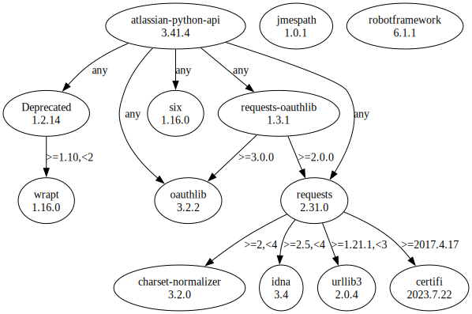

# Third Party Dependencies

<!--[[[fill sbom_sha256()]]]-->
The [SBOM in CycloneDX v1.4 JSON format](https://git.sr.ht/~sthagen/suhteita/blob/default/sbom.json) with SHA256 checksum ([f7f8ec26 ...](https://git.sr.ht/~sthagen/suhteita/blob/default/sbom.json.sha256 "sha256:f7f8ec260d7a698d4aa322616f856d33806f3c935d15f430f9af709b5fdad218")).
<!--[[[end]]] (checksum: 75217f88b768b237464c20df13acf5d2)-->
## Licenses 

JSON files with complete license info of: [direct dependencies](direct-dependency-licenses.json) | [all dependencies](all-dependency-licenses.json)

### Direct Dependencies

<!--[[[fill direct_dependencies_table()]]]-->
| Name                                                                          | Version                                                         | License                 | Author             | Description (from packaging data)                                                        |
|:------------------------------------------------------------------------------|:----------------------------------------------------------------|:------------------------|:-------------------|:-----------------------------------------------------------------------------------------|
| [atlassian-python-api](https://github.com/atlassian-api/atlassian-python-api) | [3.32.1](https://pypi.org/project/atlassian-python-api/3.32.1/) | Apache Software License | Matt Harasymczuk   | Python Atlassian REST API Wrapper                                                        |
| [jmespath](https://github.com/jmespath/jmespath.py)                           | [1.0.1](https://pypi.org/project/jmespath/1.0.1/)               | MIT License             | James Saryerwinnie | JSON Matching Expressions                                                                |
| [robotframework](https://robotframework.org)                                  | [6.0.1](https://pypi.org/project/robotframework/6.0.1/)         | Apache Software License | Pekka Klärck       | Generic automation framework for acceptance testing and robotic process automation (RPA) |
| [wrapt](https://github.com/GrahamDumpleton/wrapt)                             | [1.14.1](https://pypi.org/project/wrapt/1.14.1/)                | BSD License             | Graham Dumpleton   | Module for decorators, wrappers and monkey patching.                                     |
<!--[[[end]]] (checksum: 770ce4bc328444e5e7d092a7b1498fad)-->

### Indirect Dependencies

<!--[[[fill indirect_dependencies_table()]]]-->
| Name                                                               | Version                                                     | License                              | Author                 | Description (from packaging data)                                                                       |
|:-------------------------------------------------------------------|:------------------------------------------------------------|:-------------------------------------|:-----------------------|:--------------------------------------------------------------------------------------------------------|
| [Deprecated](https://github.com/tantale/deprecated)                | [1.2.13](https://pypi.org/project/Deprecated/1.2.13/)       | MIT License                          | Laurent LAPORTE        | Python @deprecated decorator to deprecate old python classes, functions or methods.                     |
| [certifi](https://github.com/certifi/python-certifi)               | [2022.12.7](https://pypi.org/project/certifi/2022.12.7/)    | Mozilla Public License 2.0 (MPL 2.0) | Kenneth Reitz          | Python package for providing Mozilla's CA Bundle.                                                       |
| [charset-normalizer](https://github.com/ousret/charset_normalizer) | [2.1.1](https://pypi.org/project/charset-normalizer/2.1.1/) | MIT License                          | Ahmed TAHRI @Ousret    | The Real First Universal Charset Detector. Open, modern and actively maintained alternative to Chardet. |
| [idna](https://github.com/kjd/idna/blob/master/README.rst)         | [3.4](https://pypi.org/project/idna/3.4/)                   | BSD License                          | Kim Davies (kjd)       | Internationalized Domain Names in Applications (IDNA)                                                   |
| [oauthlib](https://github.com/oauthlib/oauthlib)                   | [3.2.2](https://pypi.org/project/oauthlib/3.2.2/)           | BSD License                          | The OAuthlib Community | A generic, spec-compliant, thorough implementation of the OAuth request-signing logic                   |
| [requests-oauthlib](https://github.com/requests/requests-oauthlib) | [1.3.1](https://pypi.org/project/requests-oauthlib/1.3.1/)  | BSD License                          | Kenneth Reitz          | OAuthlib authentication support for Requests.                                                           |
| [requests](https://requests.readthedocs.io)                        | [2.28.1](https://pypi.org/project/requests/2.28.1/)         | Apache Software License              | Kenneth Reitz          | Python HTTP for Humans.                                                                                 |
| [six](https://github.com/benjaminp/six)                            | [1.16.0](https://pypi.org/project/six/1.16.0/)              | MIT License                          | Benjamin Peterson      | Python 2 and 3 compatibility utilities                                                                  |
| [urllib3](https://urllib3.readthedocs.io/)                         | [1.26.13](https://pypi.org/project/urllib3/1.26.13/)        | MIT License                          | Andrey Petrov          | HTTP library with thread-safe connection pooling, file post, and more.                                  |
<!--[[[end]]] (checksum: f4da81afee710e1802c53b7c80b42602)-->

## Dependency Tree(s)

JSON file with the complete package dependency tree info of: [the full dependency tree](package-dependency-tree.json)

### Rendered SVG

Base graphviz file in dot format: [Trees of the direct dependencies](package-dependency-tree.dot.txt)



### Console Representation

<!--[[[fill dependency_tree_console_text()]]]-->
````console
atlassian-python-api==3.32.1
  - deprecated [required: Any, installed: 1.2.13]
    - wrapt [required: >=1.10,<2, installed: 1.14.1]
  - oauthlib [required: Any, installed: 3.2.2]
  - requests [required: Any, installed: 2.28.1]
    - certifi [required: >=2017.4.17, installed: 2022.12.7]
    - charset-normalizer [required: >=2,<3, installed: 2.1.1]
    - idna [required: >=2.5,<4, installed: 3.4]
    - urllib3 [required: >=1.21.1,<1.27, installed: 1.26.13]
  - requests-oauthlib [required: Any, installed: 1.3.1]
    - oauthlib [required: >=3.0.0, installed: 3.2.2]
    - requests [required: >=2.0.0, installed: 2.28.1]
      - certifi [required: >=2017.4.17, installed: 2022.12.7]
      - charset-normalizer [required: >=2,<3, installed: 2.1.1]
      - idna [required: >=2.5,<4, installed: 3.4]
      - urllib3 [required: >=1.21.1,<1.27, installed: 1.26.13]
  - six [required: Any, installed: 1.16.0]
jmespath==1.0.1
robotframework==6.0.1
````
<!--[[[end]]] (checksum: 69fcc82f4c05a8da6e7ada6ca4bbedaa)-->
